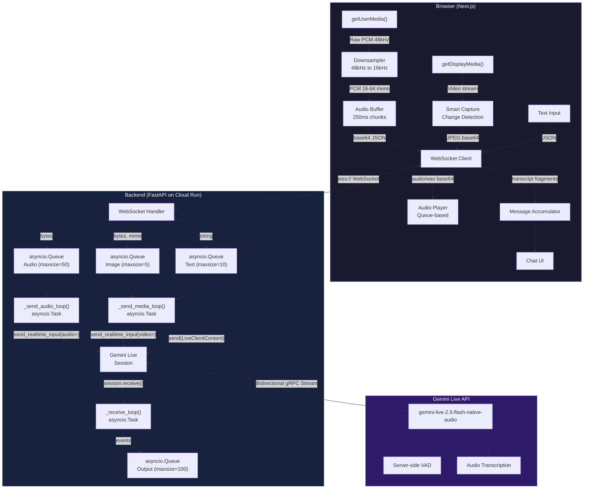
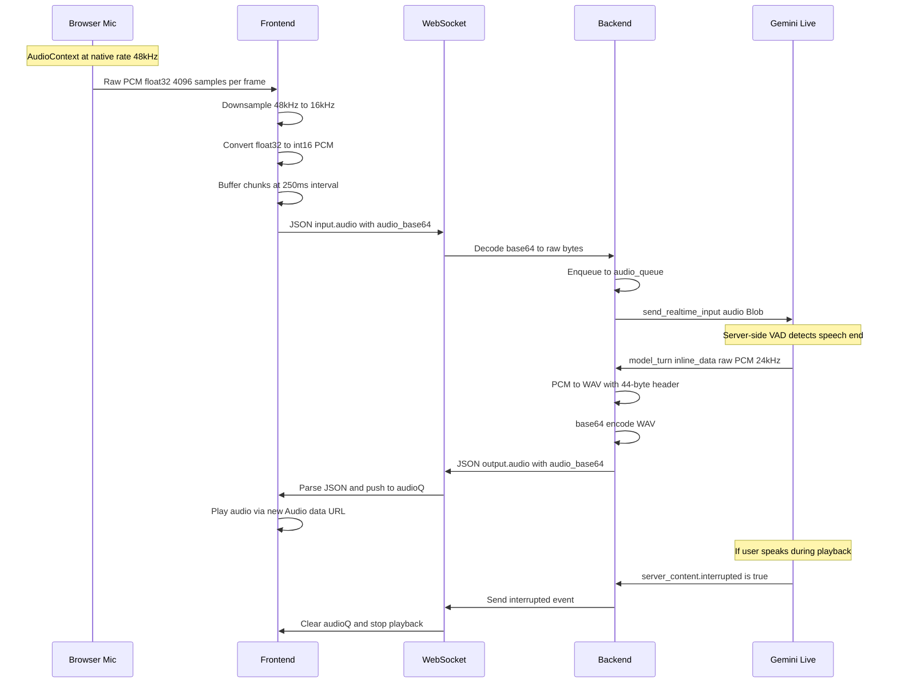
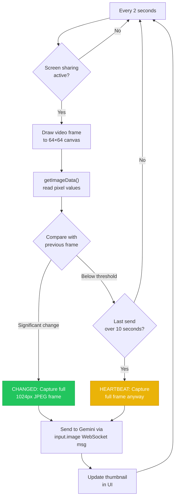
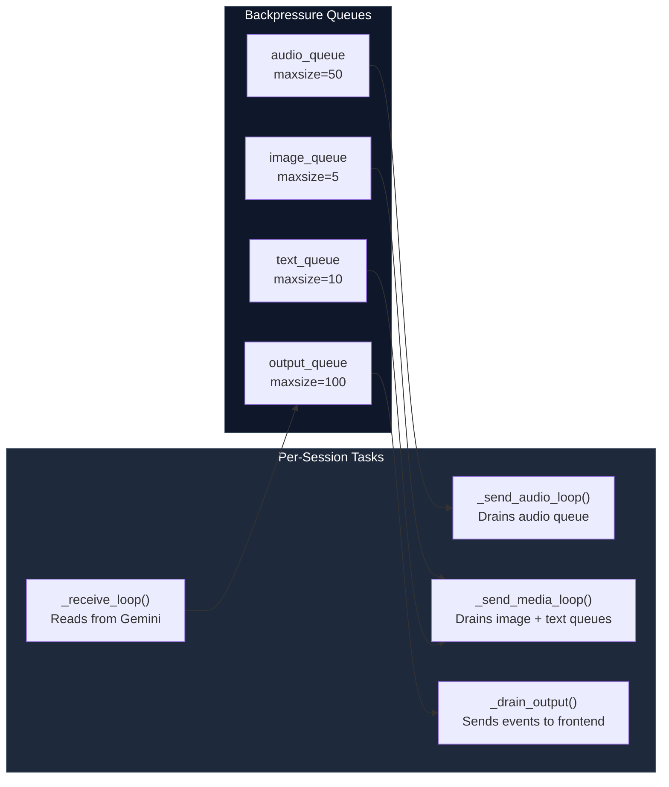
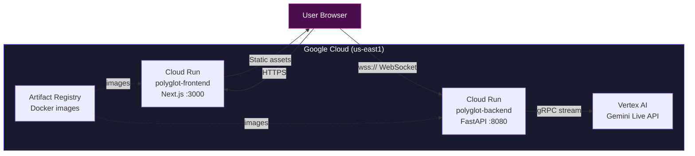

# Polyglot — Technical Architecture

Deep dive into how Polyglot achieves real-time, bidirectional voice conversations with screen understanding.

## System Overview

## Audio Pipeline

The audio path is the most latency-sensitive component. Here's the exact flow:

## Smart Screen Capture

Instead of capturing at fixed intervals, Polyglot detects actual visual changes:

## Concurrency Model

The backend runs 4 concurrent asyncio tasks per session:

**Why queues?** Without backpressure, audio floods the Gemini WebSocket faster than it can process, causing `ConnectionClosedError`. Bounded queues with drop-oldest policy keep the stream healthy.

**Why `while True` in receive?** `session.receive()` yields messages for one turn only. After `turn_complete`, the async iterator ends. Wrapping in `while True` re-enters the iterator for the next turn — this is the official Google pattern.

## Deployment Architecture

| Service | Config |
|---|---|
| **polyglot-backend** | 512Mi RAM, 1 CPU, timeout 3600s, session affinity, 0-3 instances |
| **polyglot-frontend** | 256Mi RAM, 1 CPU, default timeout, 0-3 instances |

## Key Design Decisions

1. **Server-side VAD over client-side** — Gemini's built-in voice activity detection is more accurate and eliminates client-side complexity. We just stream audio continuously.

2. **Queue-based concurrency over sequential** — Sending audio, receiving responses, and processing images happen concurrently via `asyncio.create_task()`. This prevents any one slow operation from blocking others.

3. **Client-side downsampling** — Browsers typically ignore `sampleRate: 16000` on AudioContext and default to 48kHz. We downsample manually to ensure Gemini receives correct 16kHz PCM.

4. **Transcript accumulation** — Gemini sends transcription fragments word-by-word. We accumulate them client-side and update a single message bubble, rather than creating a new bubble per fragment.

5. **PCM-to-WAV conversion** — Gemini outputs raw PCM but browsers need proper audio containers for `new Audio()` playback. We add a 44-byte WAV header server-side.
