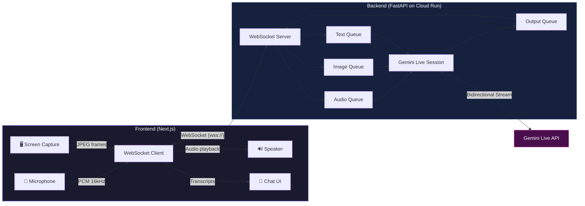

# Polyglot — Live Screen Companion

**Talk to your screen. In any language.**

Polyglot is an AI-powered live screen companion that watches what you see and has natural voice conversations about it — in 8+ languages. Built for the **Gemini Live Agent Challenge**, it combines Gemini's native audio streaming with real-time screen understanding.

> **Live Demo**: [polyglot-frontend-1064261519338.us-east1.run.app](https://polyglot-frontend-1064261519338.us-east1.run.app)

## What It Does

Share your screen and start talking. Polyglot sees what you see and responds with natural voice — no typing needed.

- **Voice Conversation** — Full-duplex voice chat powered by Gemini Live's native audio streaming. Interrupt mid-sentence, ask follow-ups, have a real conversation.
- **Screen Understanding** — Smart auto-capture detects when your screen changes and sends frames to Gemini. Switch tabs, scroll, watch a video — Polyglot keeps up.
- **Multilingual** — Speak in English, Hindi, Spanish, Japanese, German, French, Portuguese, or Korean. Polyglot responds in the same language.
- **Real-time Transcription** — See what you said and what Polyglot said, live in the conversation panel.

## Architecture Overview



## Key Technical Features

| Feature | Implementation |
|---|---|
| **Bidirectional Audio** | `send_realtime_input()` via Google GenAI SDK 1.67+ with asyncio queue-based concurrency |
| **Server-side VAD** | Gemini's built-in voice activity detection handles turn-taking naturally |
| **Smart Screen Capture** | Pixel-diff change detection (64×64 thumbnail sampling) — only sends frames when content actually changes |
| **Multi-turn Conversations** | Persistent `session.receive()` loop across turns with interrupt handling |
| **Audio Downsampling** | Client-side 48kHz→16kHz PCM conversion for correct Gemini input format |
| **Transcript Accumulation** | Fragment-level streaming assembled into complete chat messages |

## Project Structure

```
Polyglot/
├── backend/
│   ├── app/
│   │   ├── main.py            # FastAPI + WebSocket handler
│   │   ├── gemini_live.py     # Gemini Live session management
│   │   └── config.py          # Environment configuration
│   ├── Dockerfile
│   └── requirements.txt
├── frontend/
│   ├── src/app/
│   │   ├── page.tsx           # Main UI + audio/video/WS logic
│   │   ├── layout.tsx         # Root layout
│   │   └── globals.css        # Tailwind styles
│   ├── Dockerfile
│   └── package.json
├── ARCHITECTURE.md            # Detailed technical architecture
└── .env                       # Environment variables
```

## Run Locally

### Prerequisites
- Python 3.11+, Node.js 20+
- Google Cloud project with Vertex AI enabled
- `gcloud auth application-default login`

### Backend
```bash
cd backend
python -m venv .venv && source .venv/bin/activate
pip install -r requirements.txt
cp ../.env.example ../.env  # Edit with your project ID
uvicorn app.main:app --host 0.0.0.0 --port 8001 --reload
```

### Frontend
```bash
cd frontend
npm install
echo "NEXT_PUBLIC_WS_URL=ws://localhost:8001/ws/live" > .env.local
npm run dev
```

Open [localhost:3000](http://localhost:3000), click **Start**, enable mic, and talk.

## Deploy to Google Cloud

Both services run on **Cloud Run** in `us-east1`:

```bash
# Backend
docker build -t us-east1-docker.pkg.dev/YOUR_PROJECT/cloud-run-source-deploy/polyglot-backend ./backend
docker push us-east1-docker.pkg.dev/YOUR_PROJECT/cloud-run-source-deploy/polyglot-backend
gcloud run deploy polyglot-backend --image=... --region=us-east1 --allow-unauthenticated --timeout=3600 --session-affinity

# Frontend (pass backend URL at build time)
docker build --build-arg NEXT_PUBLIC_WS_URL=wss://YOUR_BACKEND_URL/ws/live -t .../polyglot-frontend ./frontend
docker push .../polyglot-frontend
gcloud run deploy polyglot-frontend --image=... --region=us-east1 --allow-unauthenticated --port=3000
```

## Tech Stack

- **Gemini Live API** — Native audio streaming with `gemini-live-2.5-flash-native-audio`
- **Google GenAI SDK** — Python SDK v1.67+ with `send_realtime_input()`
- **FastAPI** — Async WebSocket server with concurrent queue architecture
- **Next.js 16** — React frontend with Tailwind CSS v4
- **Cloud Run** — Serverless deployment with WebSocket support

## License

MIT
